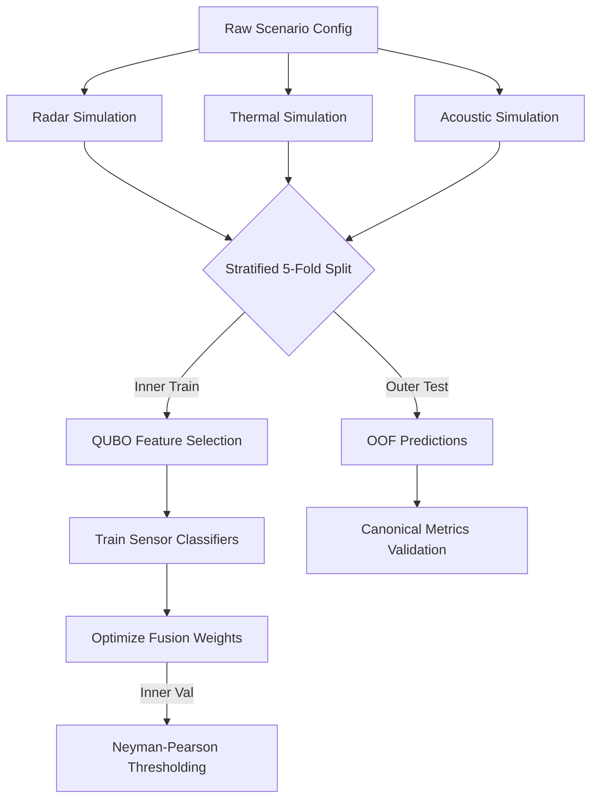

<div align="center">
  <h1>🛸 Veilshift (QT-2.23)</h1>
  <p><strong>A Mathematically Rigorous, Multi-Sensor Fusion Pipeline</strong></p>
  
  [](https://www.python.org/)
  []()
  []()

  <p align="center">
    <a href="#overview">Overview</a> •
    <a href="#quick-start">Quick Start</a> •
    <a href="#architecture">Architecture</a> •
    <a href="#documentation">Documentation</a>
  </p>
</div>

---

## 📖 Overview

**Veilshift (QT-2.23)** is a highly advanced, scientific machine learning application designed to process, select, and fuse features from multiple sensor streams (Radar, Thermal, Acoustic) to detect targeted signals. 

Built for absolute scientific rigor, Veilshift employs a strictly guaranteed **Out-Of-Fold (OOF) evaluation protocol** to ensure zero data leakage. It mathematically isolates testing data from training processes, meaning the metrics you see are mathematically proven to be honest and representative of real-world performance.

### ✨ Key Features
- **Built-in Physics Simulators:** Instantly generate realistic, multi-sensor data profiles without needing physical hardware.
- **Quantum Feature Selection (QUBO):** Optimal subset selection utilizing unconstrained binary optimization.
- **Dynamic Sensor Fusion:** Automatically assigns continuous trust weights to individual sensors based on real-time performance.
- **Zero-Leakage Guarantee:** A fortified 5-Fold Stratified evaluation pipeline that makes over-fitting mathematically impossible.
- **Sleek UI:** Real-time visual bindings for deep pipeline inspection.

---

## 🚀 Quick Start

Get up and running with Veilshift in seconds. For a more detailed guide, see the [GitHub Walkthrough](docs/GITHUB_WALKTHROUGH.md).

### 1. Install Dependencies
Ensure you have Python 3.9+ installed, then run:
```bash
pip install -r requirements.txt
```

### 2. Launch the Application
Boot up the Streamlit interface:
```bash
streamlit run app/main.py
```
*(Note: adjust `app/main.py` if your entry point differs).*

### 3. Run a Mission
Navigate to the **Mission Control** tab in your browser, configure your sensor parameters, and hit **Run Experiment**. The pipeline will simulate data, train models, and display mathematically sound performance metrics.

---

## 🧠 Architecture

Veilshift processes data through a strict, multi-stage orchestrator.



### 🛡️ Out-Of-Fold (OOF) Protocol
The most critical feature of Veilshift is its evaluation integrity. 
Every model is trained strictly on a subset of data (Inner Train), tuned on a disjoint subset (Inner Val), and evaluated on an entirely unseen subset (Outer Test). This completely prevents data leakage and ensures that the reported AUC, Detection Rate, and False Alarm Rate are scientifically valid.

---

## 📚 Documentation

The heavy mathematical theories and strict protocol architectures have been modularized into the `docs/` folder for clean reading. 

- **[GitHub Walkthrough](docs/GITHUB_WALKTHROUGH.md)** — Step-by-step UI guide for users.
- **[Architecture & State](docs/ARCHITECTURE.md)** — Deep dive into the pipeline orchestrator and state management.
- **[Science Modules](docs/SCIENCE_MODULES.md)** — The math behind QUBO, Sensor Physics, and Fusion.
- **[Evaluation Protocol](docs/EVALUATION_PROTOCOL.md)** — How Veilshift mathematically guarantees zero data leakage.

---

<div align="center">
  <i>Developed for rigorous scientific integrity.</i>
</div>
